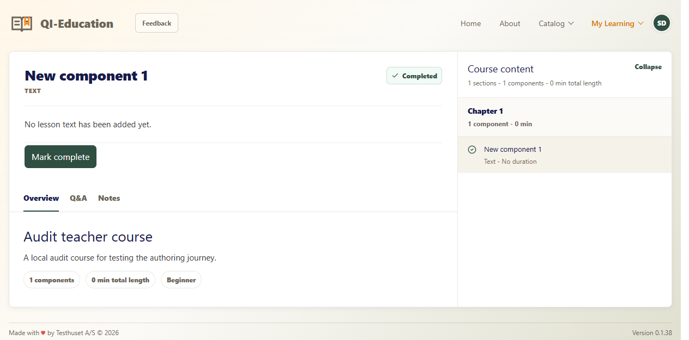
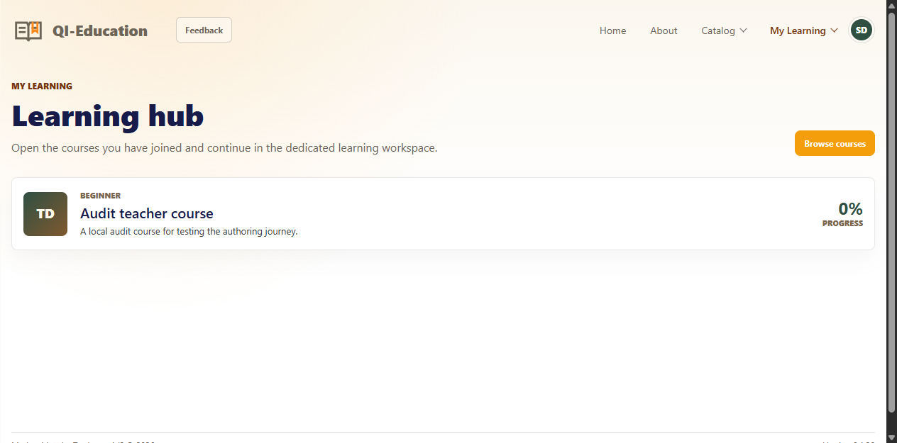

# Application audit — 2026-10-04

Audited commit: `6e19213` on `main`. Runtime: Node `v22.13.0`, Windows,
PowerShell. Product priorities and ownership policy were confirmed with the user
during the audit. This change establishes documentation; it does not fix product defects.

## Result

The application has a working foundation for authoring, catalog browsing,
enrollment, and a local learning workspace. Existing tests and builds pass, but
they do not cover several important access and journey failures found here.

Recorded **11 confirmed local/code defects**, **two imported reports awaiting
reproduction**, and **four integration/concurrency investigations** in
[defect_management.md](../../defect_management.md). The backlog contains **19 stories**
with BDD scenarios, including relevant existing GitHub feedback. US-T001 is the
first Ready candidate; the other proposals expose decisions rather than imply approval.

The most consequential findings are teacher ownership bypass, unrestricted
publication/pricing through general saves, public draft/content DTOs, and enrollment
without publication checks. These are release concerns even though the delivery
roadmap starts with teacher work and places platform improvements later.

## Method and coverage

- Read routing, state and API services, page/UI templates, auth/config, schemas,
  repository implementations, Mux/GitHub services, scripts, hooks, and CI/deployment config.
- Ran the existing API and Angular suites and both API and Pages builds.
- Started an isolated memory-backed API and a local Angular dev server.
- Exercised teacher login, catalog, draft creation, outline/component addition,
  save, and publication; learner login, enrollment, library entry, lesson completion,
  refresh/direct-route behavior, home activity, and profile entry.
- Used a browser and DOM snapshots/screenshots to inspect rendered states. Some
  offscreen browser automation clicks did not dispatch events; local DOM clicks
  were used to exercise the rendered authoring/enrollment controls. This is an
  assisted walkthrough, not a permanent E2E suite or a complete pointer/accessibility test.
- Ran isolated API probes with explicit in-memory dependencies and a disabled
  GitHub write service. Saved their outputs in [api-observations.json](api-observations.json).
- Read nine open GitHub issues (#20, #22, #23, #24, #30, #41, #42, #44, #45),
  linked relevant intake without modifying issue status or creating duplicates.

No production users or shared storage were modified. Sheets/MongoDB transactions,
real video uploads/webhook delivery/signed playback, GitHub issue creation, payments,
cross-device persistence, and a full accessibility/security review were not verified.
Admin role behavior is covered by API tests; live admin integration operation is
outside this audit's verified scope.

## Verification baseline

| Check | Observed result |
| --- | --- |
| `npm run api:test` | 5 files, 72 tests passed |
| `npm run app:test -- --watch=false` | 6 files, 24 tests passed; process exited successfully |
| `npm run api:build` | TypeScript compilation passed |
| `npm run app:build:pages` | Build and `404.html` generation passed |
| Browser startup | Login and authenticated pages render; no page errors reported by browser tool |
| Historical API probe | Completed; expected defect observations recorded, not a passing regression suite |

After the documentation/version update, the two application smoke tests and the
Pages build passed again. Documentation validation checked 14 Markdown files,
47 local links, 19 story IDs, 49 unique BDD scenario IDs, 13 defect records, and
aligned version metadata at `0.1.39`; no validation failures were found.

The Pages build reports style-budget warnings: CourseBuilder stylesheet 14.35 kB
against 12 kB, and learning-workspace stylesheet 14.00 kB against 12 kB. Its largest
lazy chunk is approximately 1.06 MB raw (video/media-related dependencies); no measured
performance failure is claimed from bundle size alone. Optimize when a relevant
story has a measured loading or interaction problem.

The doctor was not used as release proof because this server intentionally ignores
`api/.env`; the doctor reads that file and expects the configured shared integrations.
Production/real-integration readiness remains unverified.

## Reproducible API findings

Run from the repo root:

```bash
npm run api:build
node docs/audits/2026-10-04/reproduce-api.mjs
```

| Probe | Actual result | Contract gap |
| --- | --- | --- |
| Unrelated teacher patches a course | 200 | Owner policy not enforced |
| Student creates a course (control) | 403 | Role check works but is insufficient for ownership |
| Teacher general PATCH publishes and prices a course | 200 | Admin controls bypassed |
| Teacher dedicated price PATCH (control) | 403 | Dedicated route is protected |
| Anonymous catalog/content read for draft | 200, draft and body included | Private authoring disclosed |
| Anonymous quiz content read | 200, `isCorrect` included | Scoring flags exposed |
| Student enrolls in draft/archived course | 200 | Publication eligibility missing |
| Save and publish unreachable/no-correct-answer quiz | 200 | Assessment readiness missing |
| Malformed JSON / thumbnail over 2 MB | 500 / 500 | Expected 400 / 413 lost by middleware |

The script starts its own temporary loopback listener and closes it. It does not
assert that these historical failures must remain. Each defect needs a regression
test for its desired behavior when fixed.

## Browser findings

### Progress disagrees between views (DEF-007)

The audit course contained one text component. After Mark complete, the workspace
shows Completed and a check mark. Returning to the library still shows 0%.
The template hardcodes that value.





### Direct learning URL fails (DEF-010)

With a remembered student session and a persisted enrollment, direct loading of
`/library/<course-id>` reports Course not found. Selecting the same course after
visiting `/library` succeeds. `loadCoursesWhenNeeded` excludes nested library paths,
so a fresh page has no course metadata for `selectedCourse`.

### Authoring and incomplete controls

Unsaved title edits are abandoned by navigation and replaced on editor re-entry
(DEF-006). Home activity displays fixture courses and 62% active-course progress
independent of enrollments (DEF-009). Q&A and Notes leave Overview unchanged, and
Adjust track has no binding (DEF-011). Profile fields are device-local by source
inspection; no server profile endpoint exists. These findings become defects or
Proposed stories according to whether current behavior is broken or capability is missing.

## Maintainability and documentation findings

- Backend routes are concentrated in a roughly 1,400-line `server.ts`; shared app
  state is roughly 2,900 lines. Small permission/save changes cross many handlers.
  Introduce focused helpers as part of selected stories; a full rewrite is not required.
- API dependency injection and repository interfaces make isolated reproductions
  practical. Storage guards and error messages already prevent several unsafe mixed-store writes.
- Coverage is concentrated around repository/server, catalog, and UI smoke behavior.
  Ownership, editor abandonment, library deep links, and cross-view progress need
  behavior tests. Unit success alone is not an end-to-end guarantee.
- Existing guidance described backend directories that do not exist, a stale
  frontend model path, and incorrect Mux endpoint paths. This documentation change
  corrects those descriptions and links a current architecture map.
- README worksheet examples omitted newer columns; the canonical schema is now
  documented with its actual header order and widths.
- The version hook still lists an old frontend version location and applies to
  documentation commits. The workflow documents the current behavior; hooks were not changed.
- GitHub #30 remains open although a carousel is present. Reconcile against its
  intended scope later; do not create a duplicate implementation task from its title.

## Delivery structure

`AGENTS.md` establishes the entry point. `docs/work_queue.md` records active/next
work, actual branch/base, and handoff. Adjacent `user_stories.md` and
`defect_management.md` retain stable IDs and evidence. Specs define contracts,
not claimed implementation. Architecture/setup explain current behavior, while
the feature template and delivery workflow define readiness and completion.

Suggested first implementation: US-T001 ownership, including every authoring
route and the legacy admin-only fallback. Review/lifecycle controls follow next.
Do not mark the audit findings fixed merely because this documentation is committed.
