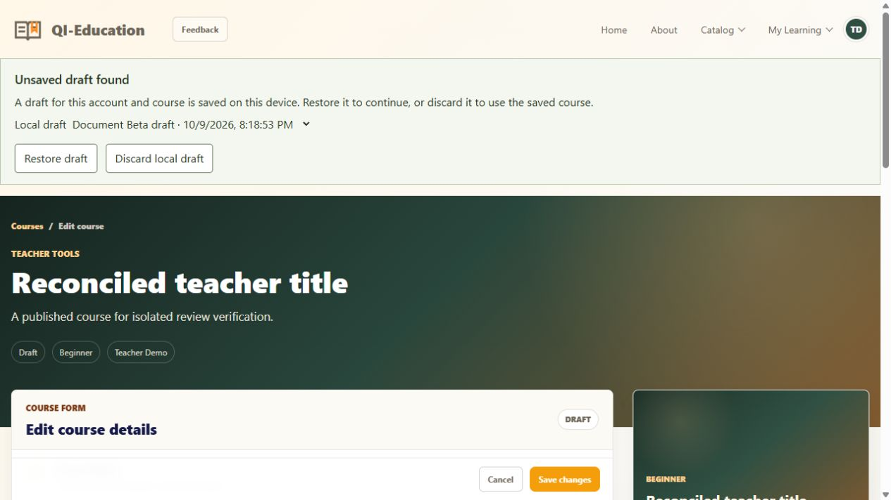
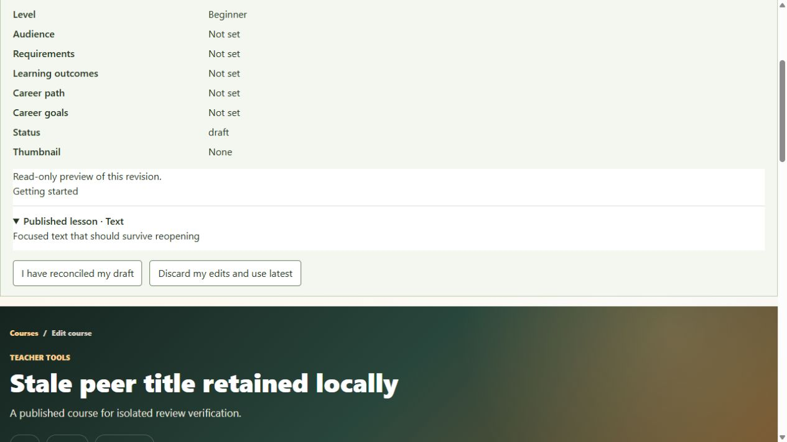

# US-T003 / US-T005 verification — 2026-10-09

Owner: Codex. Branch: `main`. Base: `5211365d2f0dd1cec6538d96a6c0ec6262e1aa50`.
Delivery: `d674ee3a24c487923ca8f8586afefb27bd191753`. DEF-015 Fixed; DEF-006 remains Fixed.
Specs: [draft recovery](../../specs/US-T003-draft-recovery.md),
[reliable saves](../../specs/US-T005-reliable-saves.md).

## Selected scope and rulings

The user selected US-T003/US-T005 and explicitly approved device-local recovery.
The earlier warnings-only choice applied to DEF-006. Recovery covers metadata,
lesson outlines, focused text and section titles for the same account/course.
Manual reconciliation is the conservative implementation ruling; it was announced,
not presented as a separately confirmed user decision. Metadata/lessons remain
sequential saves with explicit partial outcomes. No automatic merging or publication.

## Original reproduction

On base `5211365`, explicit memory repositories: read version 0 twice, PATCH a
newer title (200), PATCH the stale metadata (200). The stale title replaced newer
work at version 2. INV-001 was promoted to DEF-015. The new regression sends the
original captured precondition directly; the compatibility helper for older
fixtures fetches a fresh version only when those fixtures are testing other behavior.

## Scenario map

| Contract | Evidence |
| --- | --- |
| T003 AC01 navigation | Existing `course-navigation.spec.ts`/builder regressions from DEF-006 remain passing in the full frontend suite; original browser evidence remains in the earlier verification |
| T003 AC02 save failure | `course-save.spec.ts` partial-failure retention; T005 API provider-failure test and acknowledged retry |
| T003 AC03 recovery | `course-draft-recovery.spec.ts` account/course isolation and refreshed helper; `course-save.spec.ts` re-created editor restores metadata/focused text without auto-save; browser fresh document Restore then save |
| DR-01 stale recovered base | `course-save.spec.ts` retains old base and requires explicit reconciliation |
| DR-02 corrupt/expired/full storage, clear | Recovery helper tests malformed/nested/expired/quota/2 MB bounds; state tests confirmed-save and intentional-discard clearing; browser discards two records one at a time |
| DR-03 separate documents | Helper tests independent records, including cloned session identifiers; browser chooser shows Alpha and Beta drafts, discarding Beta preserves Alpha |
| T005 AC01 stale metadata/outline and races | `courseSave.test.ts` both prefixes, stale writes/no replacement, simultaneous writers and peer-frozen versions; state test preserves local edits until viewed-version reconciliation; browser stale title conflict, latest preview and reconciled save |
| T005 AC02 partial success/retry | API injected outline-store failure after metadata acknowledgement, retry and intervening conflict; state test says details saved/lessons unsaved and retries only lessons |
| RS-01 revision required | API missing/malformed/wrong revision identity tests, 428/409 without writing |
| RS-02 existing permissions/private review | Full ownership/lifecycle/review suites; public/learner DTOs remain private-state free; frozen peer change yields typed conflict |
| RS-03 media refresh/busy | State tests retain outline/focused buffer on newer background refresh and hold busy through delayed attachment response; builder fieldset/contenteditable disabled through media operations |

## Final review and regression pass

One independent final review of the selected code found five actionable issues.
All were addressed in one repair pass; no further review was requested.

1. First legacy save could change raw data before workflow persistence failed.
   RED API test observed changed metadata at unchanged version 0. Fix writes the
   working snapshot/version together through `saveCourseReview` from the first edit.
2. Pre-media helper cleared busy before a delayed media response could replace edits.
   RED state test observed false busy while awaiting response. Caller now holds busy
   through completion, and native controls/contenteditable are disabled throughout.
3. Duplicated tabs could copy a sessionStorage key and overwrite/remove another draft.
   RED helper test reproduced record collision. Fresh document UUIDs and an explicit
   title/date chooser preserve separate drafts across refresh/duplicate/open flows.
4. Peer submission froze the revision before the stale-version check ran, returning
   a generic error. RED API test lacked AUTHORING_CONFLICT. Revision is checked before
   editable state; local drafts can compare/use latest without adopting frozen revisions.
5. Review submission could bypass a pending Restore/Discard choice. RED state test
   saw a review request. State now blocks it and UI disables review controls.

A final browser observation found a misleading “Saving review action…” label while
awaiting recovery. The panel now separates blocked actions from pending requests;
a clean reload verified disabled Submit with no false saving label.

## Commands and checked tree

Checks ran on a materialized Git index snapshot, excluding concurrent career-path
and journey-test edits. Checked code tree: `2cbb37be68bbb2594b38fe929c661cd69374e98d`,
which is the code delivery commit's tree. The follow-up documentation commit changes
only delivery records and the aligned release display/version (0.1.58).

- `npm run api:build` — pass.
- `npm run api:test` after build — **276 tests, 14 files passed**.
- `node ../node_modules/@angular/cli/bin/ng.js test --watch=false` in `app` —
  **122 tests, 14 files passed**, rerun after the review-status label adjustment.
- `npm run app:build` — pass after the last UI change.
- `npm run app:build:pages` — pass, including SPA fallback generation.
- `git diff --cached --check` and root/app/lock/display semver alignment — pass.

An initial parallel build/test attempt hit two missing compiled-script imports;
API tests were rerun after compilation and all passed. Angular retains existing
style-budget warnings for builder/learning/career-path components (below hard error
budgets); test environment reports unimplemented scrollTo. Neither is a test failure.

## Browser and isolation evidence

Served the built staged frontend on `127.0.0.1:4202` with its API pinned to a new
explicit-memory server on `127.0.0.1:3002`. All auth/course/content/asset/feedback
repositories were isolated, Mux was disabled, and the GitHub stub refuses mutation.
No shared Sheets, MongoDB, Mux or GitHub data was mutated by probes.

Teacher: edit title and focused lesson text without closing its editor; open a fresh
document, see recovery/disabled actions, Restore, inspect the retained text, then save
metadata/lessons successfully. A second editor loaded before that save submits a
stale title: conflict retains its local title. Compare shows saved title/version 2
and the recovered text. Manually copy the latest lesson, reconcile the title,
acknowledge comparison and save successfully. Two new unsaved documents remain
separate in the chooser; discarding one leaves the other and discarding both enables
editing. Clean reload used the final built status-label correction.

## Release limits

Browser automation cannot accept a beforeunload dialog through its exposed API;
the earlier dirty reload was canceled by the browser. Actual accepted dirty refresh
is covered by helper/editor reinitialization tests and fresh-document browser
recovery, with a supported-browser manual accepted-refresh release check remaining.
Account isolation, storage quota/corruption and partial failure are automated
isolated regressions, not live provider/browser failure injection.

Hosted MongoDB lock/failure guarantees, shared Sheets composition, Mux processing
and deployed API/frontend compatibility require a separate release verification.
Full-document clients must send the new header; field-specific legacy operations
retain their narrow compatibility path. Pushing main was explicitly authorized and
triggers GitHub Pages, but these local checks do not prove hosted provider behavior.
